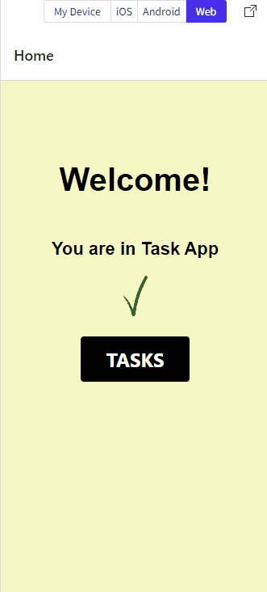

# Task List

Projeto de Lista de Tarefas para a disciplina de Hybrid Mobile App Development do 2 ano de ADS da FIAP.

Link Snack Expo: https://snack.expo.dev/@marcosnaofazisso/cp1---lista-de-tarefas

## 2TDSJ - Grupo Calíope:
Cristine Acocella (RM88251)
 
Jonathan Felix de Lima (RM88082)
 
Marcos Maciel (RM88267)
 
Marcos Vinicius Mendes Ferreira (RM86904)
 
Priscila Nastacio Fernandes de Sa (RM88849)

### Developers: 
* [Marcos Vinicius Ferreira - RM86904](https://github.com/marcosnaofazisso) 

## Goals and Rules:
O objetivo era desenvolver uma Lista de Tarefas na qual o usuário pudesse inserir uma nova tarefa e excluir tarefas da lista. Foi recomendado uso de navegação e uso de AsyncStorage. 

# Demo

Aqui temos um exemplo do funcionamento da aplicação. 

# Tutorial
Para utilizar esse projeto, é recomendado que utilize o Expo no desenvolvimento da aplicação React Native

    git init 
    git clone https://github.com/marcosnaofazisso/cp-mobile-task-list  
    npm install -g expo-cli
    npm run android

## Obrigado!

